# How to Use the CI/CD Pipeline in OpenShift Origin

## Assumptions:
- OpenShift origin is successfully installed.

## Create the DEV Environment

- Create a new project named todo-dev
- Click on Add To Project and search for mongodb. Select mongodb-persistent
- Configure mongodb settings. Set the following:
Database Service Name: mongodb
Database UserName: demo
Database Password: demo
Database Admin Password: demo
Database name: todo-api

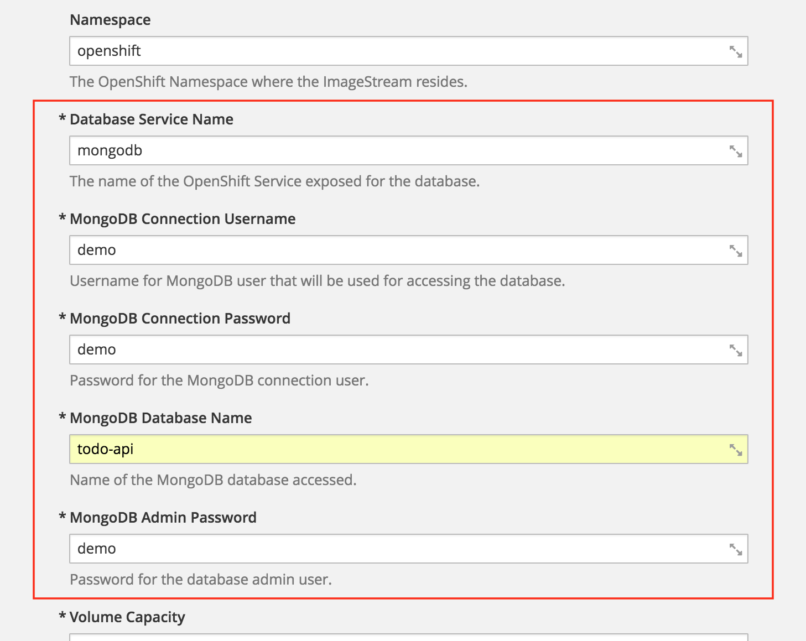
<!--  -->

- Click OK.

- Click on Add To Project and search for nodejs. Select the one at the left:

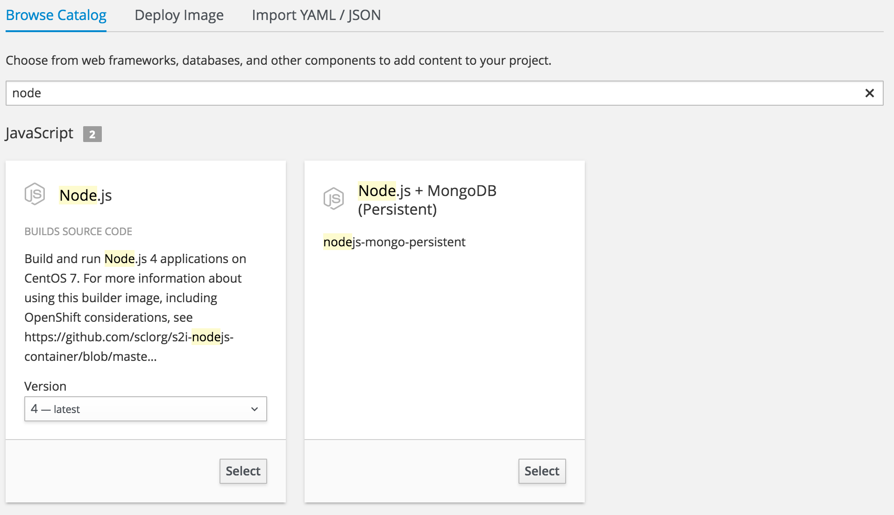
<!--  -->

- Configure NodeJS settings. Set the name and git url:

```
Name: todo
Git URL: https://github.com/corpbob/todoAPIjs.git
```

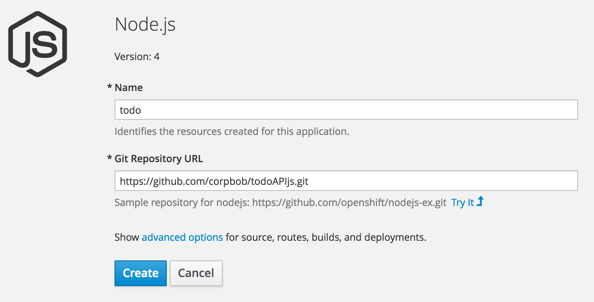
<!--  -->

- Click on "advanced options". Scroll to Deployment Options and add the environment variable below:

```
PORT = 8080
```
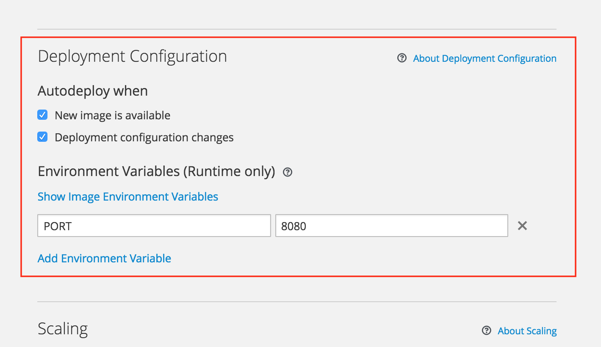
<!--  -->

- Wait for the deployment of node.js to complete. After completion, click on the link as shown below to show you the application.

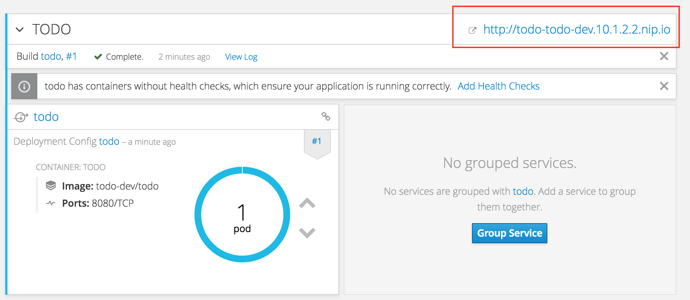
<!--  -->

- This should be you the application page like the one below. You can try to input "tasks" and explore the application.
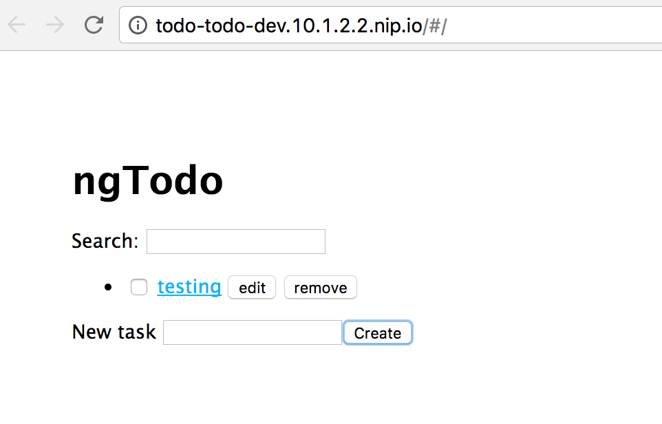
<!--  -->

- Click on Add to Project. Search for jenkins-persistent

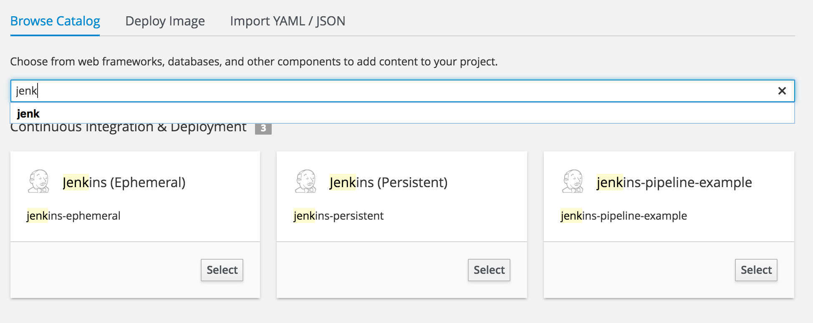
<!--  -->

- Copy the following pipeline definition to a file todo_pipeline.yml

```
apiVersion: v1
kind: BuildConfig
metadata:
  labels:
    app: jenkins-pipeline-example
    name: sample-pipeline
    template: application-template-sample-pipeline
  name: todo-pipeline
spec:
  runPolicy: Serial
  strategy:
    jenkinsPipelineStrategy:
      jenkinsfile: |-
        node('nodejs') {
          stage('build') {
            openshiftBuild(buildConfig: 'todo', showBuildLogs: 'true')
          }
          stage('deploy') {
            openshiftDeploy(deploymentConfig: 'todo')
          }
 
          stage( 'Wait for approval')
          input( 'Aprove to production?')
          stage('Deploy UAT'){
            openshiftDeploy(deploymentConfig: 'todo', namespace: 'todo-uat2')
          }

        }
    type: JenkinsPipeline
  triggers:
  - github:
      secret: secret101
    type: GitHub
  - generic:
      secret: secret101
    type: Generic
```
- Import this definition to the todo-dev project

```
oc login -u admin -p admin
oc project todo-dev
oc create -f todo_pipeline.yml
```

- Open the Pipeline Page. Click on Build->Pipelines as show below:
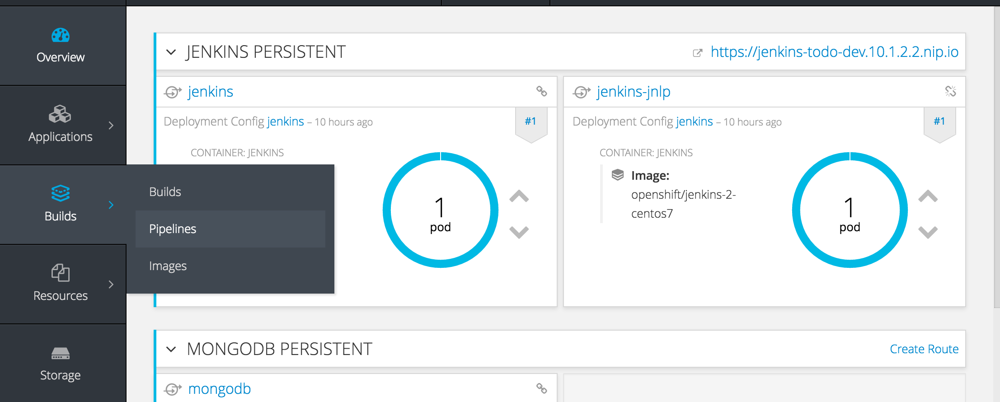
<!--  -->

- You should be able to see this:

<!--  -->

## Setup the UAT Environment

- Save the following into the file todo_mongo_secret.yml

```
apiVersion: v1
data:
  database-admin-password: ZGVtbw==
  database-password: ZGVtbw==
  database-user: ZGVtbw==
kind: Secret
metadata:
  creationTimestamp: null
  labels:
    app: mongodb-persistent
    template: mongodb-persistent-template
  name: mongodb
type: Opaque
```

- Save the following into the file todo_template_uat.yml:

```
apiVersion: v1
kind: Template
metadata:
  name: todo
objects:
- apiVersion: v1
  kind: Service
  metadata:
    creationTimestamp: null
    labels:
      app: mongodb-persistent
      template: mongodb-persistent-template
    name: mongodb
  spec:
    ports:
    - name: mongo
      port: 27017
      protocol: TCP
      targetPort: 27017
    selector:
      name: mongodb
    sessionAffinity: None
    type: ClusterIP
  status:
    loadBalancer: {}
- apiVersion: v1
  kind: Service
  metadata:
    labels:
      app: todo
    name: todo
  spec:
    ports:
    - name: 8080-tcp
      port: 8080
      protocol: TCP
      targetPort: 8080
    selector:
      deploymentconfig: todo
    sessionAffinity: None
    type: ClusterIP
  status:
    loadBalancer: {}
- apiVersion: v1
  kind: Route
  metadata:
    labels:
      app: todo
    name: todo
  spec:
    host: todo-todo-uat2.10.1.2.2.nip.io
    port:
      targetPort: 8080-tcp
    to:
      kind: Service
      name: todo
      weight: 100
    wildcardPolicy: None
- apiVersion: v1
  kind: DeploymentConfig
  metadata:
    labels:
      app: mongodb-persistent
      template: mongodb-persistent-template
    name: mongodb
  spec:
    replicas: 1
    selector:
      name: mongodb
    strategy:
      activeDeadlineSeconds: 21600
      recreateParams:
        timeoutSeconds: 600
      resources: {}
      type: Recreate
    template:
      metadata:
        creationTimestamp: null
        labels:
          name: mongodb
      spec:
        containers:
        - env:
          - name: MONGODB_USER
            valueFrom:
              secretKeyRef:
                key: database-user
                name: mongodb
          - name: MONGODB_PASSWORD
            valueFrom:
              secretKeyRef:
                key: database-password
                name: mongodb
          - name: MONGODB_ADMIN_PASSWORD
            valueFrom:
              secretKeyRef:
                key: database-admin-password
                name: mongodb
          - name: MONGODB_DATABASE
            value: todo-api
          image: centos/mongodb-32-centos7
          imagePullPolicy: IfNotPresent
          livenessProbe:
            failureThreshold: 3
            initialDelaySeconds: 30
            periodSeconds: 10
            successThreshold: 1
            tcpSocket:
              port: 27017
            timeoutSeconds: 1
          name: mongodb
          ports:
          - containerPort: 27017
            protocol: TCP
          readinessProbe:
            exec:
              command:
              - /bin/sh
              - -i
              - -c
              - mongo 127.0.0.1:27017/$MONGODB_DATABASE -u $MONGODB_USER -p $MONGODB_PASSWORD
                --eval="quit()"
            failureThreshold: 3
            initialDelaySeconds: 3
            periodSeconds: 10
            successThreshold: 1
            timeoutSeconds: 1
          resources:
            limits:
              memory: 512Mi
          securityContext:
            capabilities: {}
            privileged: false
          terminationMessagePath: /dev/termination-log
          volumeMounts:
          - mountPath: /var/lib/mongodb/data
            name: mongodb-data
        dnsPolicy: ClusterFirst
        restartPolicy: Always
        securityContext: {}
        terminationGracePeriodSeconds: 30
        volumes:
        - name: mongodb-data
          persistentVolumeClaim:
            claimName: mongodb
    test: false
    triggers:
    - imageChangeParams:
        automatic: true
        containerNames:
        - mongodb
        from:
          kind: ImageStreamTag
          name: mongodb:3.2
          namespace: openshift
      type: ImageChange
    - type: ConfigChange
- apiVersion: v1
  kind: DeploymentConfig
  metadata:
    generation: 1
    labels:
      app: todo
    name: todo
  spec:
    replicas: 1
    selector:
      deploymentconfig: todo
    strategy:
      activeDeadlineSeconds: 21600
      resources: {}
      rollingParams:
        intervalSeconds: 1
        maxSurge: 25%
        maxUnavailable: 25%
        timeoutSeconds: 600
        updatePeriodSeconds: 1
      type: Rolling
    template:
      metadata:
        creationTimestamp: null
        labels:
          app: todo
          deploymentconfig: todo
      spec:
        containers:
        - env:
          - name: PORT
            value: "8080"
          image: 172.30.1.1:5000/todo-dev/todo
          imagePullPolicy: Always
          name: todo
          ports:
          - containerPort: 8080
            protocol: TCP
          resources: {}
          terminationMessagePath: /dev/termination-log
        dnsPolicy: ClusterFirst
        restartPolicy: Always
        securityContext: {}
        terminationGracePeriodSeconds: 30
    test: false
    triggers:
    - imageChangeParams:
        automatic: false
        containerNames:
        - todo
        from:
          kind: ImageStreamTag
          name: todo:latest
          namespace: todo-dev
      type: ImageChange
    - type: ConfigChange
- apiVersion: v1
  kind: PersistentVolumeClaim
  metadata:
    labels:
      app: mongodb-persistent
      template: mongodb-persistent-template
    name: mongodb
  spec:
    accessModes:
    - ReadWriteOnce
    resources:
      requests:
        storage: 1Gi

```

- Give jenkins the permission to edit todo-uat project
```
oc policy add-role-to-user edit system:serviceaccount:todo-dev:jenkins -n todo-uat
```

- Create a new project todo-uat
- Import the mongo secret:
```
oc create -f todo_mongo_secret.yml 
```
- Save docker authentication information to be used when pulling the images from dev:

```
oc secrets new-dockercfg pull-secret --docker-server=172.30.1.1:5000 --docker-username=admin --docker-password=$(oc whoami -t) --docker-email=admin@example.com
```

- Link this secret to the service account 
```
oc secrets add serviceaccount/default secrets/pull-secret --for=pull
```

- Import the template todo_template_uat.yml

```
oc create -f todo_template_uat.yml 
```

- Create the todo app

```
oc new-app todo
```
- Your UAT should look like the below. Notice that there is no deployment for the "todo" service but the mongodb is deployed.

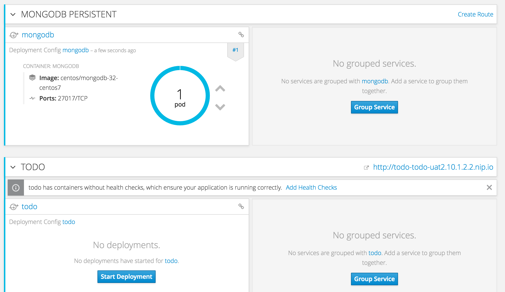
<!--  -->

## Starting the CI/CD Pipeline

- Go back to project todo-dev. Click on Builds->Pipelines. 

<!--  -->

- You can also take a look at Jenkins and see the progress

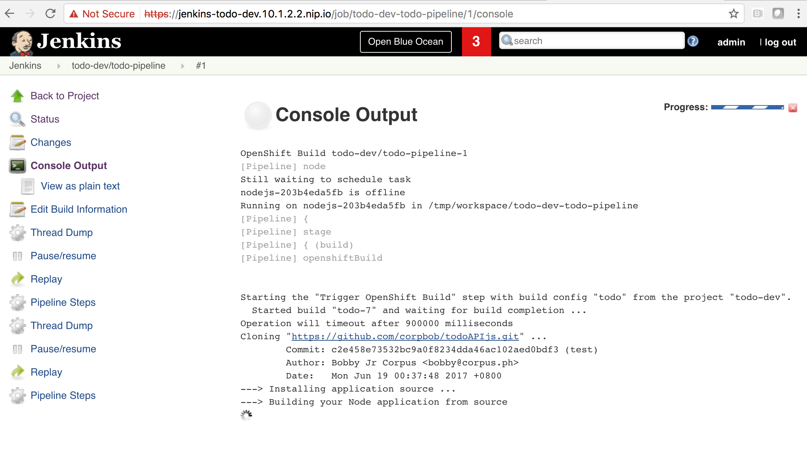
<!--  -->

- The DEV environment will now do a rolling deployment 
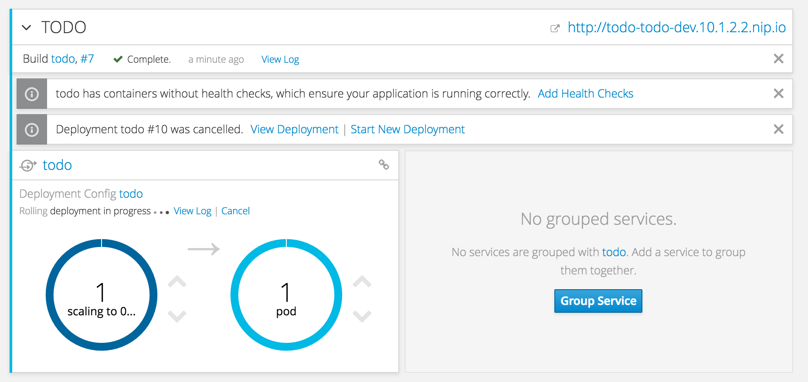
<!--  -->

- The Pipeline will now reach the Approval Stage:

<!--  -->

- Click on Input Required. Click on  Approve. The todo service in UAT will now deploy
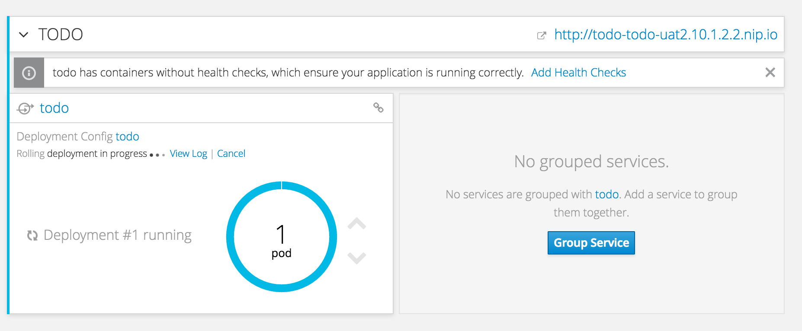
<!--  -->

- The pipeline will show that it is complete:

<!--  -->

# Congratulations, you have setup the CI/CD Pipeline!
