# Steps to configure, spin up DEV-TEST w/ CICD environment in a Container Platform

## Assumptions
- You have installed and started Docker, and have used it to build, run, exec images
- You have installed OpenShift/Origin client. Instructions here:
  - [install_openshift_origin_single_node.md](../documents/install_openshift_origin_single_node.md)
  - [install_openshift_origin_single_node_aws.md](../documents/install_openshift_origin_single_node_aws.md)
```
sh dev-boot-up.sh

or go through the CLI, manually

oc cluster up \
--public-hostname=10.1.2.2 --routing-suffix=10.1.2.2.icd.rfg.io \
--host-data-dir=/var/lib/origin/dev.local.data
```

- You are logged in to OpenShift/Origin as admin

```
[root@openshiftdev OpenShiftHowToGuides]# oc whoami
admin
```

- If not, then log in as admin

```
[root@openshiftdev ~]# oc login -u admin
Logged into "https://10.0.2.15:8443" as "admin" using existing credentials.

You have access to the following projects and can switch between them with 'oc project <projectname>':

  * default
    kube-system
    myproject
    openshift
    openshift-infra

Using project "default".
```

## Build the MarkLogic 9 Docker Image 

- Manual instructions are here [build_marklogic_docker_image](../documents/build_marklogic_docker_image.md)
- Or run the script under redconnect/DEV.LOCAL/sh spin-ml-docker-origin.sh

## Push the MarkLogic Docker image to OpenShift namespace

- Tag it first

```
docker tag marklogic9 172.30.1.1:5000/openshift/marklogic9
```

- Login to internal docker registry
```
docker login -u admin -p $(oc whoami -t) 172.30.1.1:5000
```

- Push the image 
```
[root@openshiftdev ~]# docker push 172.30.1.1:5000/openshift/marklogic9
The push refers to a repository [172.30.1.1:5000/openshift/marklogic9]
ed592544bda0: Pushed 
c4d1a54cbe8c: Pushed 
109dc775307d: Pushed 
12d0ed825c00: Pushed 
a2183695d4bf: Pushed 
88fee9aaa960: Pushed 
dc1e2dcdc7b6: Layer already exists 
latest: digest: sha256:47319f54d674621a27ea90dc6c86edb0fe3db0b20184bf3b9a91b417e3f8f1ea size: 9964
```

- This should create an ImageStream in the openshift namespace. You can check this by issuing the command:

```
[root@openshiftdev OpenShiftHowToGuides]# oc get is -n openshift|grep marklogic
marklogic9   172.30.1.1:5000/openshift/marklogic9   latest                         About a minute ago
```

- You can view the contents of the ImageStream config file by issuing this command:

```
[root@openshiftdev ~]# oc export is marklogic9 -n openshift
apiVersion: v1
kind: ImageStream
metadata:
  creationTimestamp: null
  generation: 1
  name: marklogic9
spec:
  tags:
  - annotations: null
    from:
      kind: DockerImage
      name: 172.30.1.1:5000/openshift/marklogic9:latest
    generation: null
    importPolicy: {}
    name: latest
    referencePolicy:
      type: ""
status:
  dockerImageRepository: ""
```
## Build the slush-marklogic-node Source-2-Image Docker Image 
- Instructions are here [build_slush_marklogic_node_docker_s2i_image.md](../documents/build_slush_marklogic_node_docker_s2i_image.md)

## Create DEV environment

- Open to familiarize with the file [slush-marklogic-node-template.yml](MarkLogic/slush-marklogic-node-template.yml)
- Then spin the DEV environment project automatically by invoking, sh spin-dev-env.sh
- Create dev project manually,

```
oc new-project ml-dev
```

- Allow MarkLogic to run as root user.
```
oc adm policy add-scc-to-user anyuid -z default
```

- Save the docker credentials for pushing and pulling
```
oc secrets new-dockercfg push-secret --docker-server=172.30.1.1:5000 --docker-username=admin --docker-password=$(oc whoami -t) --docker-email=admin@example.com
oc secrets add serviceaccount/default secrets/push-secret --for=pull,mount
```

- Import the template
```
oc create -f MarkLogic/slush-marklogic-node-template.yml
```

- Create a new app

```
oc new-app slush-marklogic-node-app
```
- After completion, your console should look like the following:

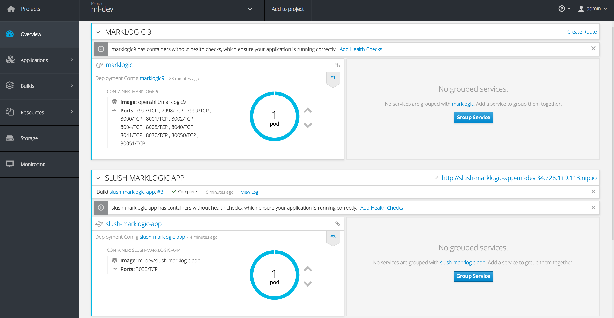

- Import the pipeline by invoking the command

```
oc create -f MarkLogic/slush-marklogic-node-pipeline.yml 
```

You should see a jenkins service was added:

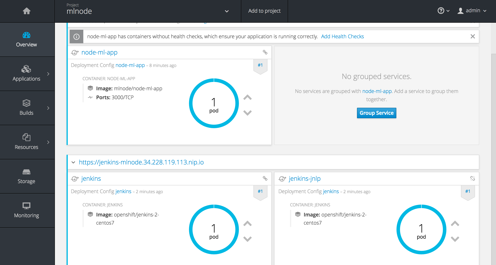

Navigate to the pipeline to see it:

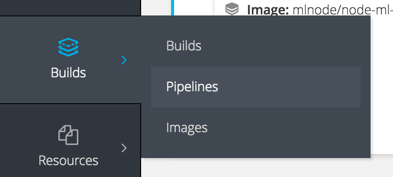

The pipeline that is yet to be started looks like:

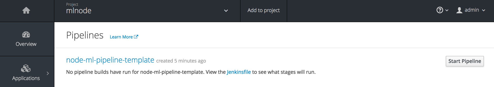

However, we cannot start this yet. We need to create the UAT Environment.


## Create UAT Environment

- Create uat project

```

oc new-project ml-uat
```

- Allow MarkLogic to run as root user.
```
oc login -u system:admin
oc adm policy add-scc-to-user anyuid -z default
oc login -u admin -p admin
```

- Save the docker credentials for pushing and pulling
```
oc secrets new-dockercfg push-secret --docker-server=172.30.1.1:5000 --docker-username=admin --docker-password=$(oc whoami -t) --docker-email=admin@example.com
oc secrets add serviceaccount/default secrets/push-secret --for=pull,mount
```

- Import the template
```
oc create -f MarkLogic/slush-marklogic-node-template-uat.yml
```

- Create a new app

```
oc new-app slush-marklogic-node-app
```
- After completion, your console should look like the following:

TODO: this image should be uat environment.
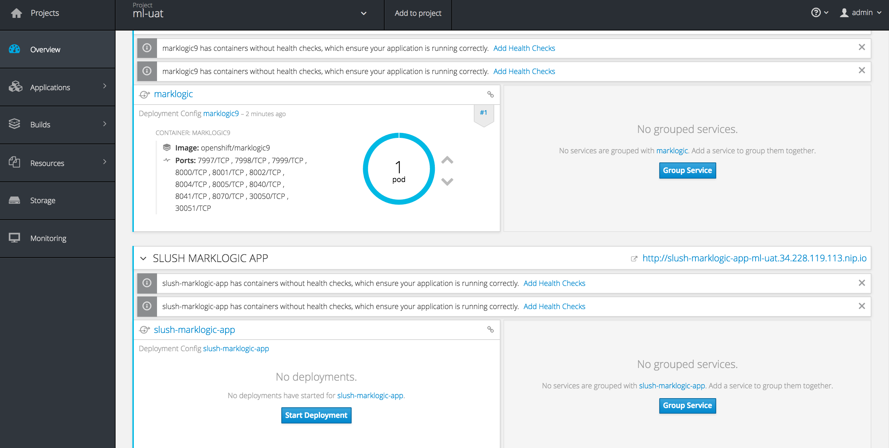


### We need to give jenkins service account in mlnode project edit access to mlnode-uat

```
[root@localhost marklogic]# oc policy add-role-to-user edit system:serviceaccount:ml-dev:jenkins -n ml-uat
role "edit" added: "system:serviceaccount:ml-dev:jenkins"
```
# Running the CI/CD Pipeline

If you click on the jenkins like you'll find the pipeline:

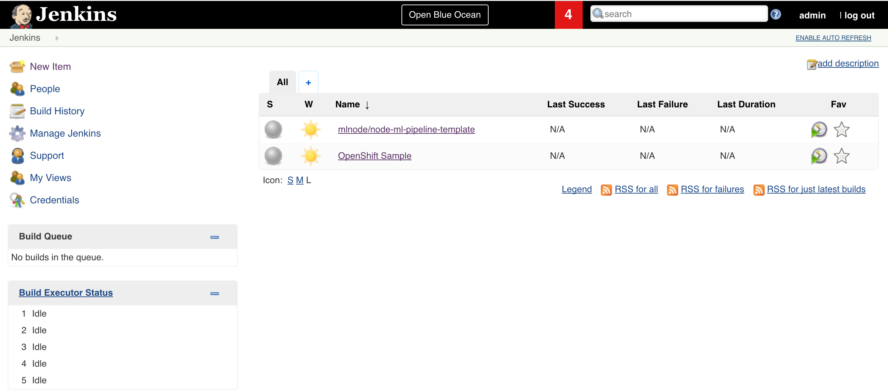

## Start the pipeline

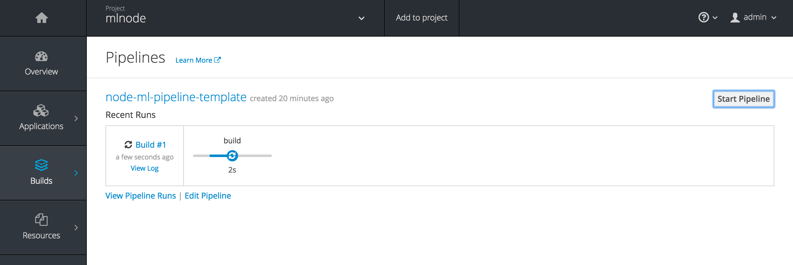

You can also look at the jenkins log:

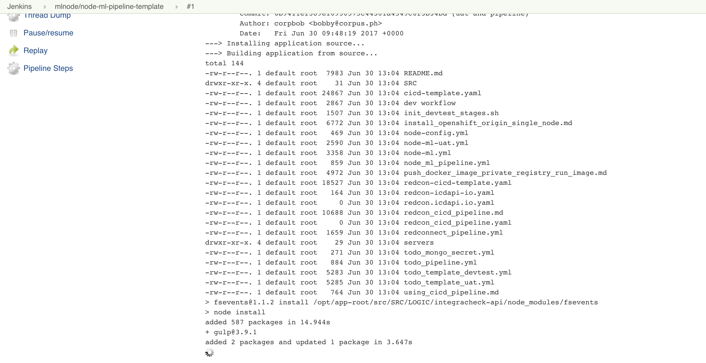

## Wait for Approval

At this stage the pipeline will wait for an Approver to give the go-signal.

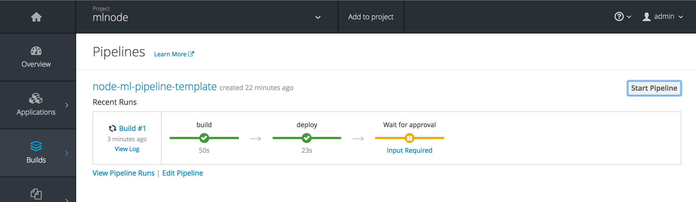

## Click on Approve to deploy to UAT

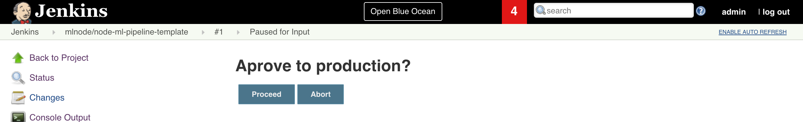

## Pipeline Deploying to UAT

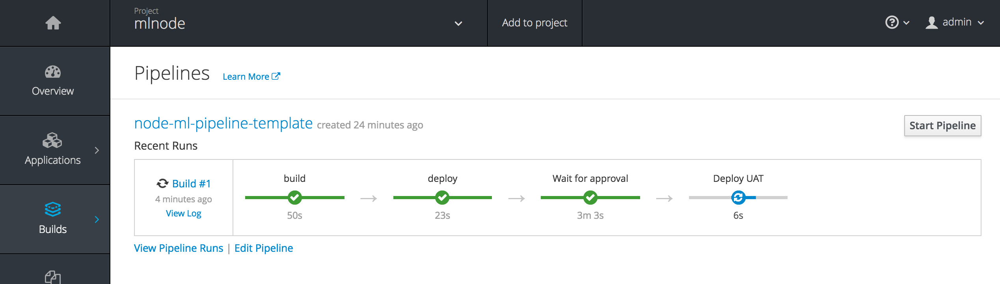

## Congratulations! You just deployed to TEST using the pipeline!

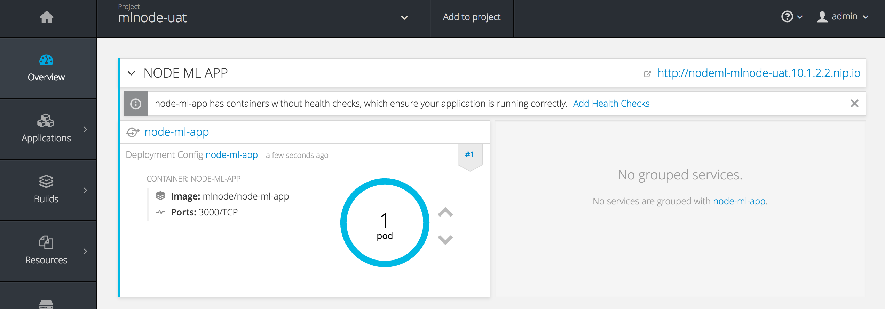

## Click on the route above to launch the slush-marklogic-node app. You shoud see something like this:

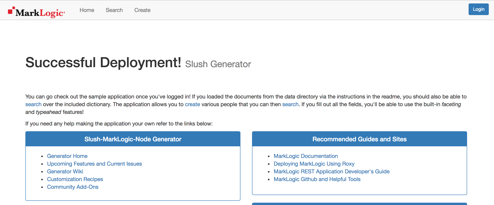

## Login the the application using credentials

```
username: admin
password: admin
```
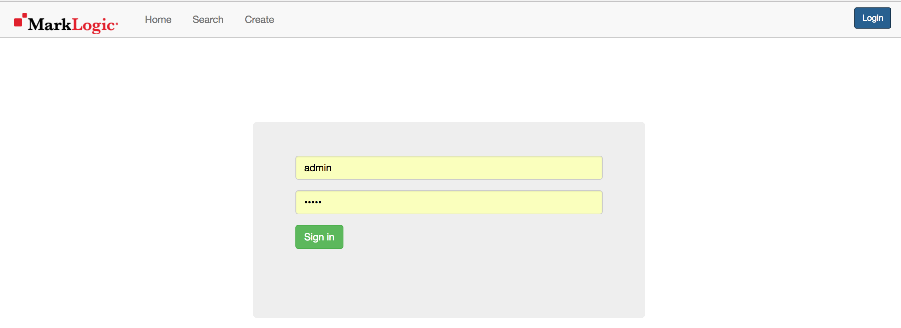

## Click on the search menu to get the following:

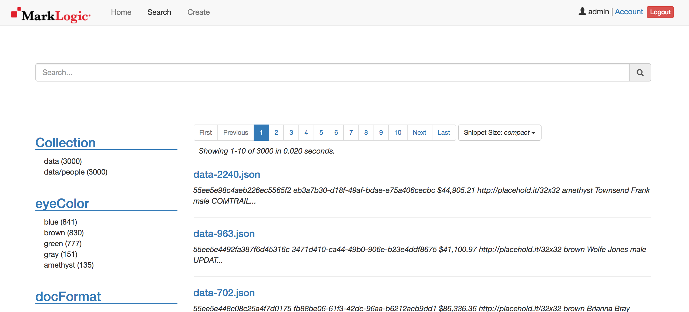

# Congratulations you have now completed CI/CD setup of MarkLogic on OpenShift!